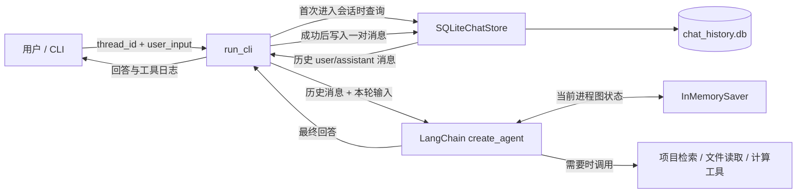
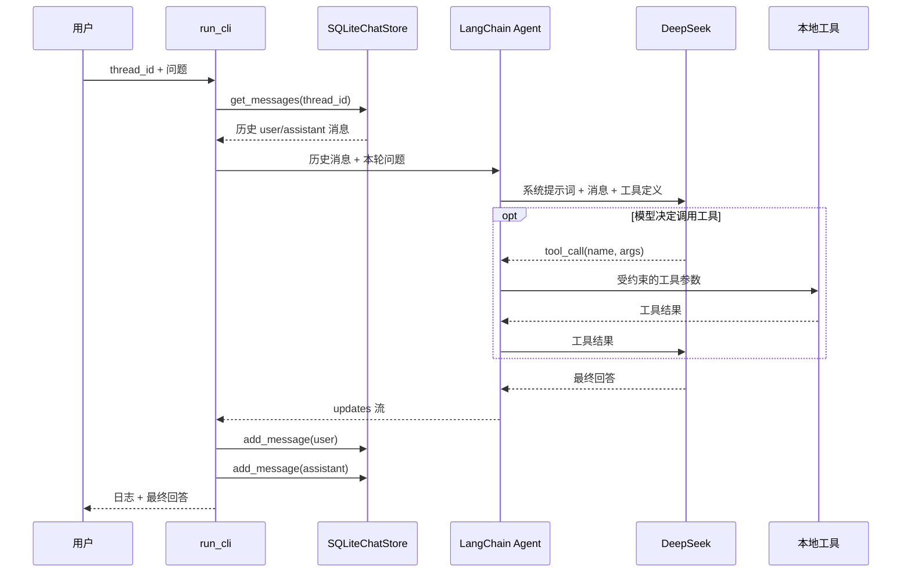

# Day 3：SQLite 跨进程对话记忆

## 今日成果

Day 2 的 `InMemorySaver` 只能在一个 Python 进程内记住上下文。Day 3 增加了应用层
`SQLiteChatStore`：Agent 每轮成功回答后，把用户输入和最终回答写入本地 SQLite；程序重新
启动并首次访问同一个 `thread_id` 时，再把历史消息恢复到 Agent 上下文。

本地数据库默认位于 `.agent_data/chat_history.db`，该目录已加入 `.gitignore`，不会上传
GitHub。

## 运行方式

```powershell
& "C:\Users\19194\.conda\envs\langchain1.2\python.exe" chapter03_agent\project_learning_agent.py
```

建议按下面顺序验证：

```text
/thread day3-study
我叫小林，目标是学习 Agent 开发，请记住。
/history
/quit
```

重新启动程序后：

```text
/thread day3-study
我叫什么，我的目标是什么？
```

看到 `[记忆恢复]` 表示 SQLite 历史已在该进程中首次加载。

新增命令：

```text
/threads   查看 SQLite 中已有的会话
/history   查看当前会话的持久化消息
/clear     删除当前会话，并切换到一个新的空会话
```

## 系统架构



## 模块输入输出

| 模块 | 数据来源 | 输入 | 输出 | 去向 |
|---|---|---|---|---|
| `run_cli` | 终端用户 | 命令、`thread_id`、问题 | 调用参数、终端文本 | Store、Agent、终端 |
| `SQLiteChatStore` | CLI | 会话 ID、角色、消息文本 | 消息列表、消息 ID、删除数量 | CLI / SQLite 文件 |
| `stream_agent_turn` | CLI、SQLite | 历史消息、本轮问题 | 最终回答、工具日志 | CLI / Store |
| `create_agent` | DeepSeek、工具、checkpointer | LangChain 消息列表 | AI 消息或工具调用 | 流式处理函数 |
| 本地工具 | Agent | 关键词、文件路径或表达式 | 受限文本结果 | Agent |
| `InMemorySaver` | Agent | 当前进程的图状态 | 当前会话 checkpoint | Agent |

## Data Lineage（数据血缘）



关键边界：

- 发送给 DeepSeek：系统提示词、当前会话历史、本轮问题、工具定义，以及实际产生的工具结果。
- 不会自动发送：`.env`、SQLite 数据库文件、整个磁盘或没有被工具读取的项目文件。
- 写入 SQLite：用户文本和最终助手文本。
- 不写入 SQLite：API Key、工具调用中间状态、完整 LangGraph checkpoint。

## 为什么同时存在两种记忆

`InMemorySaver` 保存当前进程里的完整 Agent 图状态，适合多轮工具调用；SQLite 存储层只保存
可阅读的用户/助手消息，适合程序重启后的上下文恢复。后者不是完整 checkpoint，因此无法恢复
中断在一半的工具调用。生产版本可以进一步使用 PostgreSQL checkpointer 统一持久化完整图状态。

## 代码知识树

```text
Day 3 持久化记忆
├── Python / SQLite
│   ├── sqlite3.connect
│   ├── 参数化 SQL（? 占位符）
│   ├── 事务提交与连接关闭
│   ├── 主键 id 保证消息顺序
│   └── 索引 (thread_id, id)
├── 数据建模
│   ├── StoredMessage dataclass
│   ├── thread_id 会话隔离
│   └── role 约束：user / assistant
├── Agent 记忆
│   ├── SQLite 跨进程聊天历史
│   ├── InMemorySaver 进程内图状态
│   ├── 首次 hydration
│   └── 成功回答后持久化
├── 安全与隐私
│   ├── 参数化 SQL 防注入
│   ├── .agent_data 加入 .gitignore
│   └── 不保存 API Key
└── 测试
    ├── 重开数据库仍可读取
    ├── thread 隔离
    ├── 定向清除
    └── 输入角色校验
```

## 第一轮模拟面试

请先不看答案，用自己的语言回答：

1. `InMemorySaver` 和 `SQLiteChatStore` 分别保存什么？
2. 为什么恢复历史只在一个 `thread_id` 首次进入时执行？
3. SQL 参数为什么不能用 f-string 拼接？
4. 为什么消息按 `id` 排序，而不是只依赖时间字符串？
5. 为什么必须显式 `connection.close()`？
6. 如果模型调用失败，本实现为什么不写入本轮用户消息？有什么取舍？
7. 这套实现与 PostgreSQL checkpointer 相比缺少什么能力？

## 黑盒学习任务

不要求默写完整代码，按以下方式掌握：

1. 运行两次程序，验证同一 `thread_id` 能跨进程恢复。
2. 使用 `/thread interview` 创建第二个会话，验证隔离。
3. 使用 `/history` 和 `/threads`，根据输出猜测对应 SQL 查询。
4. 阅读 `SQLiteChatStore` 的四个公开方法，只口述输入、输出和异常。
5. 回答上面的七道面试题；根据回答结果生成补强任务。

## 面试项目介绍（Day 3 版本）

> 我基于 LangChain 1.2 和 DeepSeek 实现了一个项目学习 Agent。它具备受限的项目检索、文件读取、
> 安全计算、工具调用日志和基于 `thread_id` 的多轮对话。为解决进程退出后记忆丢失的问题，我增加
> 了 SQLite 应用层存储：首次进入会话时恢复历史，每轮成功回答后持久化用户和助手消息，并通过
> 参数化 SQL、角色约束、会话索引和 Git 忽略规则保证基本安全性。同时我保留 InMemorySaver 管理
> 当前进程的图状态，并明确说明应用层聊天历史与完整 checkpoint 的能力边界。
