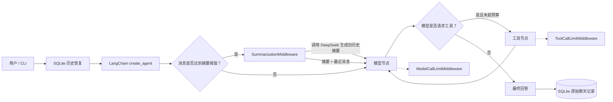
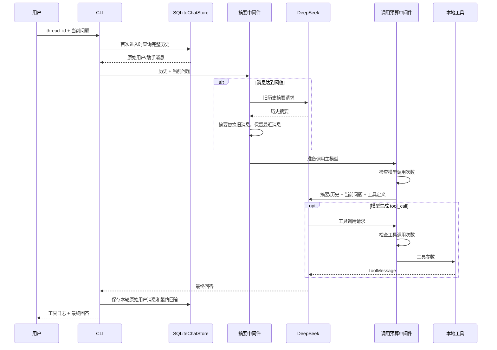

# Day 4：上下文工程与 Agent 运行预算

## 今日目标

Day 3 解决了“程序退出后聊天记录丢失”，但同一个 `thread_id` 的历史会持续增长。Day 4 使用
LangChain 1.2 中间件增加两类生产保护：

1. 历史消息达到阈值后，调用模型生成摘要，并保留最近消息；
2. 限制单轮模型调用和工具调用次数，防止循环失控。

官方将这种“控制每次模型看到什么，以及在 Agent 生命周期中加入摘要、限制和日志”的工作称为
上下文工程。

## 新增配置

默认配置：

```text
历史消息达到 30 条 → 触发摘要
摘要后保留最近 12 条消息
单轮最多调用模型 8 次
单轮最多调用工具 6 次
```

运行：

```powershell
& "C:\Users\19194\.conda\envs\langchain1.2\python.exe" chapter03_agent\project_learning_agent.py
```

为了观察摘要，可以在测试会话中临时降低阈值：

```powershell
& "C:\Users\19194\.conda\envs\langchain1.2\python.exe" `
  chapter03_agent\project_learning_agent.py `
  --thread day4-demo `
  --summary-trigger-messages 6 `
  --summary-keep-messages 2 `
  --model-call-limit 8 `
  --tool-call-limit 6
```

摘要会产生额外模型调用和 token 消耗。低阈值只用于演示，不建议作为日常默认值。
触发成功时 CLI 会显示：

```text
[上下文摘要] 旧历史已压缩，最近消息继续保留。
```

## 系统架构



## 模块输入输出

| 模块 | 输入 | 输出 | 作用 |
|---|---|---|---|
| `AgentRuntimeSettings` | 四个正整数配置 | 已校验的运行设置 | 集中管理摘要和调用预算 |
| `SummarizationMiddleware` | Agent 消息状态 | 摘要消息 + 最近消息 | 压缩旧上下文 |
| `ModelCallLimitMiddleware` | 当前 run 的模型调用计数 | 继续或结束 | 控制成本与死循环 |
| `ToolCallLimitMiddleware` | 当前 run 的工具调用计数 | 执行或限制结果 | 防止无限工具循环 |
| `InMemorySaver` | 图步骤状态 | 当前进程 checkpoint | 保存摘要后的 Agent 状态 |
| `SQLiteChatStore` | 最终用户/助手消息 | 完整原始聊天记录 | 跨进程恢复和历史查看 |

## Data Lineage



## 两种历史为什么同时保留

```text
SQLiteChatStore
→ 保留完整、可阅读的原始聊天
→ /history 仍能查看完整记录

InMemorySaver 中的 Agent 状态
→ 旧消息可能被摘要替换
→ 控制当前进程后续模型调用的上下文长度
```

当前方案的边界：摘要后的图状态只在 `InMemorySaver` 中，因此程序重启后会从 SQLite 重新加载完整
历史，达到阈值时再次摘要。生产版本使用数据库 checkpointer 后，可以持久化摘要后的图状态，避免每次
重启重复摘要。

## 为什么摘要不等于简单删除

直接删除旧消息会丢失姓名、目标和关键决策。摘要会尝试保留高价值信息：

```text
原始旧历史：
用户姓名、学习目标、已经完成的功能、错误与修复、后续任务……

摘要：
用户小林正在准备 Agent 实习；项目已实现工具调用、SQLite 记忆；下一步学习上下文管理。
```

摘要仍有风险：

- 摘要模型可能遗漏细节；
- 摘要本身需要额外 token、费用和时间；
- 错误摘要会影响后续对话；
- 关键事实最好使用结构化长期记忆，而不是只依赖自然语言摘要。

## 运行预算

一次 Agent run 从收到一条用户问题开始，到输出最终回答或被限制结束。

```text
模型调用预算：
初次判断 + 工具结果后的再次判断 + 可能的多轮推理 ≤ 8

工具调用预算：
calculate / search_project_files / read_project_file 的总调用数 ≤ 6
```

预算是服务端安全边界。即使以后允许用户选择不同档位，也不能让用户无限调大。

## 知识树

```text
Day 4 上下文工程
├── 模型上下文
│   ├── system prompt
│   ├── 历史消息
│   ├── 当前问题
│   ├── 工具定义
│   └── ToolMessage
├── 摘要策略
│   ├── trigger：何时摘要
│   ├── keep：保留多少最近消息
│   ├── 摘要模型调用
│   └── 摘要状态持久化边界
├── 执行预算
│   ├── model call limit
│   ├── tool call limit
│   ├── 超时（后续扩展）
│   └── token / 成本预算（后续扩展）
├── 中间件
│   ├── Agent 生命周期钩子
│   ├── 横切能力
│   └── 组合顺序
└── 测试
    ├── 配置合法性
    ├── 摘要阈值
    ├── 模型调用预算
    └── 工具调用预算
```

## 黑盒学习步骤

1. 正常运行 Agent，观察启动时打印的四项预算。
2. 使用低摘要阈值创建测试会话，连续对话直到触发摘要。
3. 执行 `/history`，确认 SQLite 原始记录仍然存在。
4. 解释为什么“数据库保存了全部历史”不代表“模型每次必须看到全部历史”。
5. 将模型调用上限临时设为较小值，观察复杂工具任务如何安全结束。

## 面试题

1. 上下文工程与 Prompt Engineering 有什么区别？
2. 为什么历史摘要能降低 token，但不能保证事实完全不丢失？
3. `trigger` 和 `keep` 分别控制什么？
4. 为什么 SQLite 保留完整记录，而模型状态可以只保留摘要？
5. 模型调用上限和工具调用上限分别防止什么风险？
6. 为什么限制应该按 run 设置，而不是允许用户无限调大？
7. 摘要为什么会产生额外模型调用？
8. 当前方案为什么会在进程重启后重新摘要？

## 面试项目介绍（Day 4 版本）

> 我在 LangChain 1.2 项目学习 Agent 中加入了上下文工程中间件。对话达到消息阈值时，系统自动使用
> 模型压缩旧历史并保留最近消息，降低长会话的上下文占用。同时使用模型调用和工具调用预算限制
> Agent 单轮执行，避免工具循环造成延迟和费用失控。SQLite 继续保存完整原始聊天，而摘要后的图状态
> 由 InMemorySaver 管理；我也明确识别了重启后需要重新摘要的边界，并计划通过数据库 checkpointer
> 持久化完整图状态。
