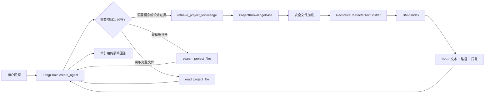
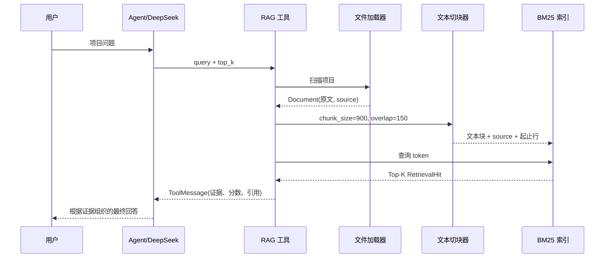

# Day 5：带来源引用的 Agentic RAG

## 今天完成了什么

Day 4 的 Agent 已有记忆、摘要和调用预算，但回答项目问题时只能搜索关键词或读取完整文件。Day 5
增加一条完整的本地 RAG 链路：

```text
允许的项目文件
→ Document
→ 切成带重叠的知识块
→ 中文/英文 token
→ BM25 索引
→ Top-K 相关片段
→ 带路径和行号的 ToolMessage
→ DeepSeek 综合证据回答
```

RAG（Retrieval-Augmented Generation，检索增强生成）的核心不是“训练模型”，而是在回答前从外部知识源
取回相关证据。LangChain 官方把文档加载、切分、Embedding、向量存储和 Retriever 列为典型检索模块；
Agentic RAG 则由 Agent 根据问题决定是否以及何时调用检索工具：

- [LangChain Retrieval](https://docs.langchain.com/oss/python/langchain/retrieval)
- [LangGraph Agentic RAG](https://docs.langchain.com/oss/python/langgraph/agentic-rag)
- [LangChain Knowledge Base](https://docs.langchain.com/oss/python/langchain/knowledge-base)

本项目当前使用 BM25 而不是 Embedding，目的是先用零额外 API 成本的方式学清 RAG 数据流。

## Day 4 与 Day 5 的差别

| 能力 | Day 4 原来 | Day 5 现在 |
|---|---|---|
| 找知识 | 搜索精确关键词，返回匹配行 | 对知识块计算相关度，返回 Top-K |
| 给模型的上下文 | 可能需要读取完整文件 | 只给最相关的几个片段 |
| 答案证据 | 模型可能只描述文件名 | 工具返回 `路径:L起始-L结束` |
| Agent 决策 | 计算、搜索、读文件 | 新增“是否需要 RAG”的工具决策 |
| 隐私范围 | `.env` 和隐藏文件受限 | 额外阻止个人 `interview_note` 和本地数据目录 |
| 可替换性 | 搜索逻辑在 Agent 文件中 | 知识库独立封装，之后可替换向量检索 |

## 系统架构



`create_agent` 仍负责模型与工具循环；`ProjectKnowledgeBase` 只负责检索，不直接回答问题。

## Data Lineage



第一次检索时创建索引；同一 Python 进程内使用 `lru_cache` 复用索引，不会每轮重复扫描。

## 每个模块的输入与输出

| 模块 | 输入 | 输出 | 数据来源 |
|---|---|---|---|
| `load_project_documents` | 项目根目录 | `Document` 列表 | 允许的 `.py/.md/.txt/...` |
| `split_project_documents` | 原始 `Document` | 带 `source/start_line/end_line` 的块 | 文件原文 |
| `tokenize_for_bm25` | 查询或知识块文本 | 中英文 token | 本地字符串 |
| `BM25Index.search` | query、`top_k` | 按相关度排序的 `RetrievalHit` | 内存索引 |
| `format_search_results` | 检索结果 | 带证据和引用的文本 | Top-K 知识块 |
| `retrieve_project_knowledge` | 模型工具参数 | `ToolMessage` 内容 | 本地知识库 |
| DeepSeek | 用户问题 + ToolMessage | 最终自然语言回答 | 模型推理 |

## 源码讲解

### 1. 安全加载

文件：`chapter04_rag/project_knowledge.py`

`ALLOWED_KNOWLEDGE_SUFFIXES` 是白名单；`EXCLUDED_DIRECTORIES` 是禁止目录。加载器不会索引 `.env`、
`.agent_data`、`.git`、`.tools`、`interview_note`、测试代码和 `AGENTS.md`。测试中的重复查询容易干扰
面向知识讲解的排序，需要看测试实现时仍可使用精确搜索工具。这体现两点：并非项目中的所有文件都应该
发送给模型，而且“文本相关”不一定等于“最适合回答”。

### 2. 文档切块

`split_project_documents` 使用 `RecursiveCharacterTextSplitter`：

- `chunk_size=900`：限制一个知识块的最大字符数；
- `chunk_overlap=150`：相邻块保留部分重复内容，降低关键句被边界切断的风险；
- `add_start_index=True`：保存块在原文件中的字符位置；
- 通过统计换行符，把字符位置换算成起止行号。

切块不是越小越好。太小会丢失上下文，太大又会带入噪声并增加 token。

### 3. BM25 相关度

`BM25Index` 关注三个量：

1. 查询词是否出现在知识块中；
2. 这个词在当前知识块出现多少次（TF）；
3. 这个词是否在所有知识块里都很常见（IDF）。

它还通过知识块长度归一化，避免长文档只因词多就天然占优。当前中文分词会生成单字和相邻双字，
英文和 Python 标识符按单词处理。这适合教学和小项目，但不是真正的语义理解。

### 4. 来源引用

`RetrievalHit` 保留 `source`、`start_line`、`end_line` 和 `score`。工具输出示例：

```text
[来源 1] docs/day04-context-engineering.md:L1-L24  相关度=12.345
（真实知识块内容）
```

引用来自加载与切块阶段的元数据，不是让模型凭空生成。System Prompt 要求模型在答案中使用
`[路径:L起始-L结束]`。真实演示发现模型仍可能漏掉引用，因此 `ensure_retrieval_citations` 会记录本轮
RAG ToolMessage 的真实来源；若最终回答没有使用其中任何一个，就自动附加“检索来源（系统补全）”。
它保证来源不会完全丢失；更严格的生产系统还应验证每条结论是否真的被对应证据支持。

### 5. Agentic RAG 工具

文件：`chapter03_agent/project_learning_agent.py`

`retrieve_project_knowledge` 被注册为 LangChain `@tool`。模型看到工具名称、说明和参数后，可以决定：

- 概念、架构、设计问题：调用 RAG；
- 找某个精确函数：调用文本搜索；
- 需要完整源码：调用安全文件读取；
- 已有足够上下文：直接回答。

工具负责取证，模型负责理解和表达，这就是“检索”和“生成”的职责分离。

## 你今天要掌握的知识树

```text
Agentic RAG
├─ 为什么检索
│  ├─ 模型不知道私有项目
│  └─ 降低幻觉并提供证据
├─ 数据准备
│  ├─ 安全文件白名单
│  ├─ Document + metadata
│  └─ chunk size / overlap
├─ 召回
│  ├─ token
│  ├─ TF / IDF
│  ├─ BM25
│  └─ Top-K
├─ Agent 编排
│  ├─ tool schema
│  ├─ tool_call
│  ├─ ToolMessage
│  └─ 最终回答
├─ 可信性
│  ├─ source
│  ├─ line range
│  └─ 引用验证
└─ 下一步
   ├─ Embedding
   ├─ Vector Store
   ├─ Hybrid Search
   └─ Reranker
```

## 如何运行与观察

先运行本地测试，不消耗 DeepSeek：

```powershell
& "C:\Users\19194\.conda\envs\langchain1.2\python.exe" -m unittest discover -s tests -v
```

再启动 Agent：

```powershell
& "C:\Users\19194\.conda\envs\langchain1.2\python.exe" chapter03_agent\project_learning_agent.py
```

可以提问：

```text
请检索项目知识，解释 Day 4 如何限制上下文和工具调用，并给出文件行号来源。
```

观察 CLI 的三个阶段：

1. `[工具调用] retrieve_project_knowledge`：模型发起工具请求；
2. `[工具结果]`：本地检索返回 Top-K 证据；
3. `[最终回答]`：模型把 ToolMessage 包装成面向用户的回答。

## 面试时怎样介绍

### 30 秒版本

> 我用 LangChain 1.2 和 DeepSeek 做了一个项目学习 Agent。它不仅有 thread_id 会话隔离、SQLite
> 持久化记忆、上下文摘要和调用预算，还实现了本地 Agentic RAG。项目文档会被安全加载并切块，
> 用 BM25 召回 Top-K 证据，工具把文件路径和起止行号返回给模型，再由模型生成带引用的答案。
> 我还限制了可索引目录，并用单元测试覆盖检索排序、引用和敏感文件隔离。

### 2 分钟展开顺序

1. 痛点：模型不了解本地项目，读取完整文件又浪费上下文；
2. 方案：Loader → Splitter → BM25 → Tool → DeepSeek；
3. Agentic：由模型判断何时检索，而不是每个问题都固定检索；
4. 可信：每个块携带 source 和行号，回答要求引用；
5. 安全：白名单索引，排除密钥、个人笔记和运行数据；
6. 验证：24 个本地测试，不调用付费 API；
7. 局限：BM25 不理解同义词，下一步升级混合检索和 reranker。

## 面试官可能追问

1. RAG 和模型微调有什么区别？
2. 为什么需要 chunk overlap？设置过大会怎样？
3. BM25 和向量检索各自擅长什么？
4. 为什么不能把检索到的所有内容都交给模型？
5. Agentic RAG 与固定“先检索再回答”的 2-step RAG 有什么区别？
6. 行号引用能完全消除幻觉吗？
7. 知识库文件更新后，当前缓存索引为什么可能过期？

## 当前限制

- BM25 是词法检索，同义表达没有共同词时可能召回失败；
- 索引仅在进程内缓存，文件变化后需重启或增加缓存失效机制；
- 没有 reranker，Top-K 只按 BM25 排序；
- 引用有真实元数据，但还未做最终回答的自动引用校验；
- 当前适合小型代码仓库，大仓库应使用持久化索引和增量更新。
