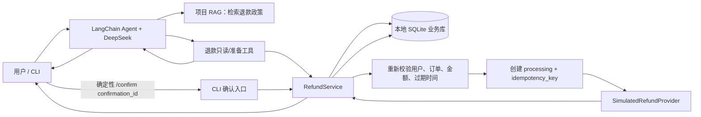
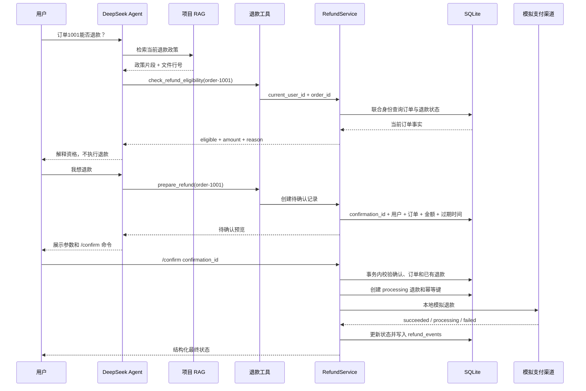
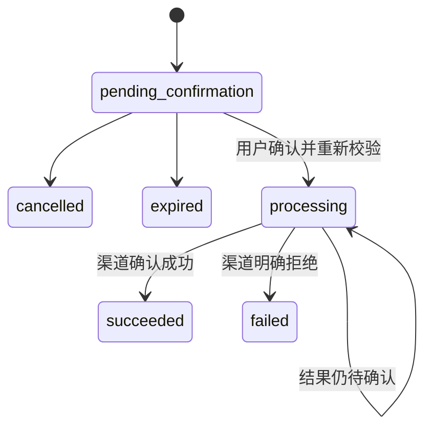
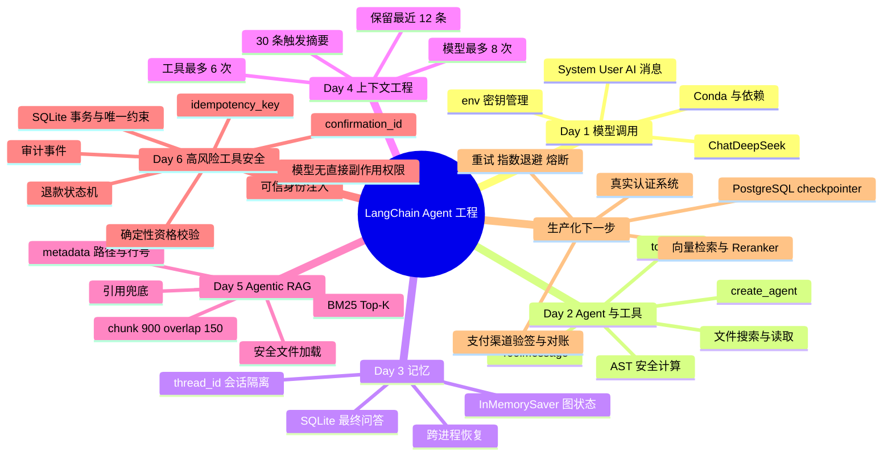

# Day 6：安全退款 Agent

## 今天完成了什么

Day 5 让 Agent 能从私有项目知识中检索证据。Day 6 解决新的问题：

> 当工具会产生退款这类真实副作用时，怎样让模型参与理解和编排，但不把最终业务权限交给模型？

本项目新增一个只操作本地 SQLite 的模拟退款域，不连接真实支付渠道，也不会产生真实资金变化。

```text
模型负责：理解问题、查询订单、检查资格、生成待确认记录、解释状态
业务代码负责：身份隔离、规则校验、确认绑定、事务、幂等、状态转换
用户负责：核对订单和金额，并通过确定性 CLI 命令明确确认
```

## Day 5 与 Day 6 的改进

| 能力 | Day 5 原来 | Day 6 现在 |
|---|---|---|
| 工具类型 | 读取、搜索、计算等低风险工具 | 新增会产生本地业务副作用的模拟退款 |
| 用户身份 | 本地单用户 thread_id | 退款工具闭包注入可信 current_user_id |
| 业务判断 | 模型结合证据回答 | 退款资格由确定性服务判断 |
| 用户授权 | 自然语言问题 | confirmation_id 绑定明确参数 |
| 防重复 | 工具次数限制 | idempotency_key + 数据库唯一约束 |
| 并发 | 未涉及业务写入竞争 | `BEGIN IMMEDIATE` 保证一个确认只创建一条退款 |
| 状态 | 工具返回文本 | processing / succeeded / failed 状态机 |
| 审计 | CLI 工具日志 | refund_events 保存状态转换 |

## 系统架构



模型的工具列表中没有“直接执行退款”工具。真正的模拟副作用只能通过 CLI 拦截的 `/confirm` 命令进入
`RefundService.confirm_and_execute`。

## Data Lineage



## 模块输入输出

| 模块 | 输入 | 输出 | 责任 |
|---|---|---|---|
| `build_refund_tools` | RefundService、可信 user_id | 五个 LangChain 工具 | 隐藏 user_id，暴露最小业务参数 |
| `list_my_orders` | 无模型参数 | 当前用户订单 JSON | 只读自己的订单 |
| `check_refund_eligibility` | order_id | eligible、金额、原因 | 确定性资格判断 |
| `prepare_refund` | order_id | confirmation_id、预览、过期时间 | 只准备，不执行 |
| CLI `/confirm` | confirmation_id | 退款结构化结果 | 用户明确授权入口 |
| `RefundService` | 可信身份和业务参数 | 状态与审计事件 | 事务、规则和幂等 |
| `SimulatedRefundProvider` | order、金额、幂等键 | 渠道结构化结果 | 本地模拟，不接真实资金 |

## 源码讲解

### 1. RefundService：业务事实和安全边界

文件：`chapter05_refund/refund_service.py`

它创建四张表：

```text
orders                订单事实
refund_confirmations  用户明确确认的参数
refunds               当前退款业务状态
refund_events         每次状态转换的审计记录
```

订单查询始终使用：

```text
current_user_id + order_id
```

因此只知道其他用户的订单号也无法读取数据。错误信息统一为“订单不存在或无权访问”，不泄露资源是否存在。

### 2. confirmation_id：把自然语言变成确定授权

`prepare_refund` 会把以下字段绑定到服务端记录：

```text
user_id
order_id
amount_cents
expires_at
status=pending_confirmation
```

用户说“确认”并不足够；CLI 提交具体 `confirmation_id` 后，服务端才能知道用户确认了哪一个订单和金额。
确认默认 10 分钟过期，只能使用一次。

### 3. 幂等和并发

同一个确认记录使用稳定的：

```text
idempotency_key = refund:<confirmation_id>
```

数据库对 `confirmation_id` 和 `idempotency_key` 都设置唯一约束。`confirm_and_execute` 使用
`BEGIN IMMEDIATE` 在事务中检查和创建退款，因此两个线程同时确认时只有一个能够创建业务记录。
第二次确认只返回第一次的 refund_id 和状态，不再次调用渠道。

### 4. 状态机



`processing` 不能被模型包装成“成功”。订单只有在退款状态成为 `succeeded` 后才改为 `refunded`。

### 5. 可信身份不进入 tool schema

文件：`chapter05_refund/refund_tools.py`

`build_refund_tools(service, current_user_id=...)` 使用闭包注入已认证身份。模型看到的参数只有 `order_id`
或 `refund_id`，看不到也不能填写 `user_id`。这演示了：

```text
业务参数由模型提取
身份和权限由服务端注入
```

### 6. 模型没有直接退款权限

文件：`chapter05_refund/refund_agent.py`

普通自然语言进入 Agent；`/confirm`、`/cancel` 和 `/status` 由 CLI 在模型调用之前拦截。即使文档或用户
诱导模型退款，模型也只能创建待确认记录，无法执行副作用。

## Day 1–6 知识体系



### Day 6 新增点位

Day 1–5 主要解决“模型怎样理解、记忆、检索和使用工具”。Day 6 增加的是：

```text
Agent 工具调用
└─ 高风险副作用治理
   ├─ 谁在操作：可信身份
   ├─ 操作什么：confirmation_id 绑定参数
   ├─ 是否重复：idempotency_key
   ├─ 当前进度：状态机
   ├─ 并发安全：事务与唯一约束
   └─ 谁能执行：模型无直接权限
```

它位于“工具调用”分支下面，同时横跨安全、数据库一致性和生产可靠性。

## 如何运行

全部测试：

```powershell
& "C:\Users\19194\.conda\envs\langchain1.2\python.exe" -m unittest discover -s tests -v
```

不调用 DeepSeek 的本地黑盒演示：

```powershell
& "C:\Users\19194\.conda\envs\langchain1.2\python.exe" chapter05_refund\refund_agent.py --demo
```

可交互 Agent：

```powershell
& "C:\Users\19194\.conda\envs\langchain1.2\python.exe" chapter05_refund\refund_agent.py
```

演示订单：

```text
order-1001  demo-user  未发货，可本地模拟全额退款
order-1002  demo-user  已发货，只能进入人工退货流程
order-2001  other-user  用于验证跨用户访问被拒绝
```

## 测试覆盖

Day 6 新增 15 项测试，总测试数达到 39，覆盖：

- 当前用户只能看到自己的订单；
- 未发货/已发货资格分支；
- 待确认记录绑定订单和金额；
- 重复 prepare 复用未过期确认；
- 过期和取消确认不能执行；
- 成功后更新订单状态；
- 重复和并发确认只调用一次渠道；
- processing 不会误报成功；
- failed 保留错误码和 retryable；
- refund_events 记录状态转换；
- tool schema 不暴露 user_id。

## 面试时怎样介绍

### 30 秒版本

> Day 6 我在原有 LangChain RAG Agent 上增加了一个本地模拟退款域，重点不是让模型能退款，而是限制模型
> 的权限。模型只能查订单、判断资格和创建待确认记录，真正执行必须由用户通过确定性 CLI 命令确认。
> 服务端使用 confirmation_id 绑定用户、订单、金额和过期时间，用 idempotency_key、SQLite 事务和唯一约束
> 防止重复或并发退款，并用状态机和事件表记录整个过程。

### 两分钟展开顺序

1. 风险：模型幻觉、提示词注入和重试可能造成错误或重复副作用；
2. 权限：user_id 由工具闭包注入，不让模型填写；
3. 资格：订单事实和退款规则由代码校验；
4. 授权：prepare 只生成 confirmation_id，CLI 确认才执行；
5. 一致性：processing 先落库，再调用模拟渠道；
6. 幂等：相同确认复用相同业务结果；
7. 可观测：状态机和 refund_events 提供审计；
8. 边界：当前仅本地模拟，真实系统还需认证、PostgreSQL、支付验签、对账和熔断。

## 当前限制

- 只使用 CLI 参数模拟认证用户，没有真正的登录/session/JWT；
- 只连接本地模拟支付渠道，不连接真实资金系统；
- SQLite 适合单机教学，不适合多实例生产并发；
- processing 状态还没有后台轮询、回调验签和自动对账；
- 没有实现生产级重试、指数退避和熔断；
- 退款政策仍是教学规则，不是可配置的正式规则引擎。
