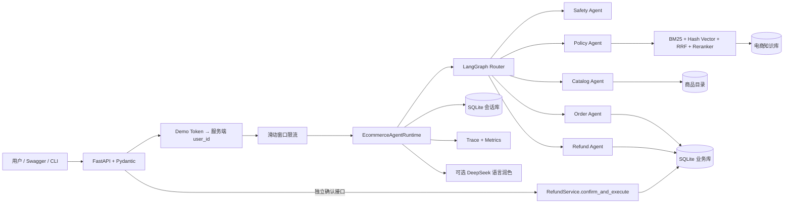
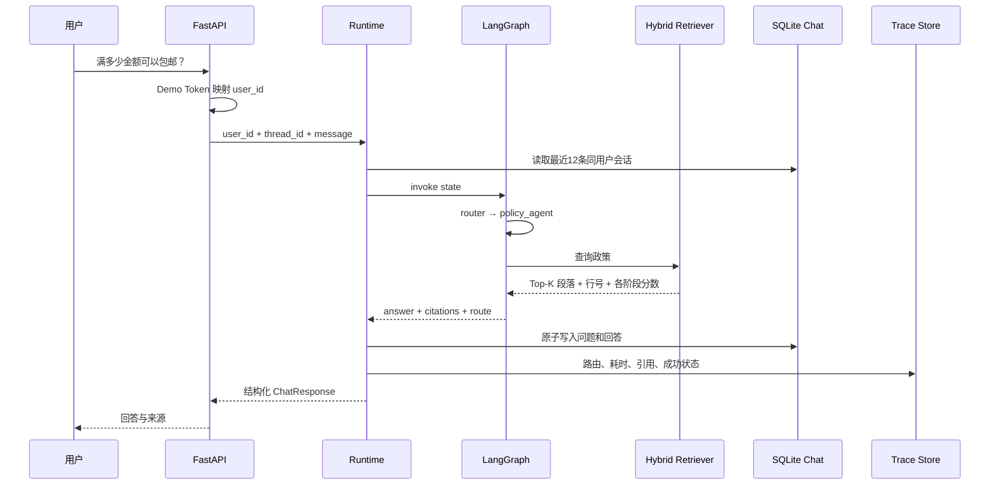
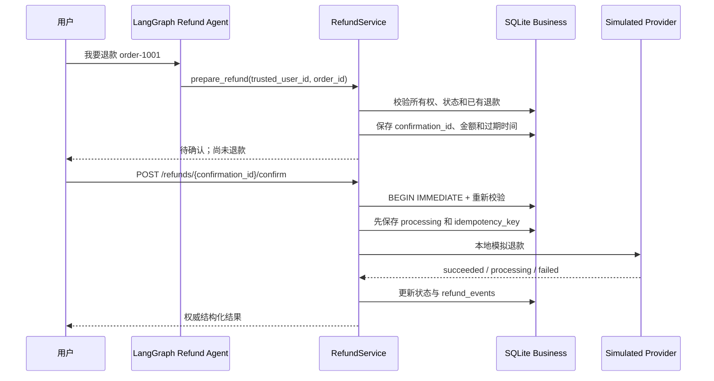
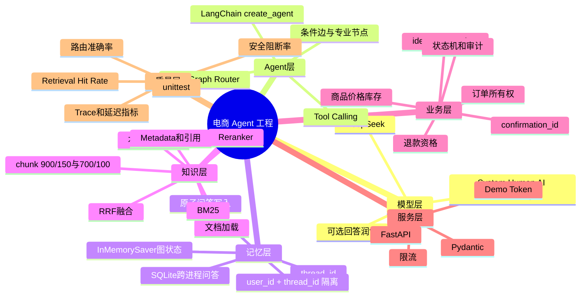

# Day 14：星河商城电商客服 Agent

## 项目定位

这是一个面向求职作品集的电商客服 Agent 原型，支持商品推荐、政策问答、订单查询和安全退款。核心目标不是让模型拥有更多权限，而是让大模型在可验证的知识、可信业务数据和确定性工作流内工作。

它解决五类电商痛点：

1. 商城政策多且频繁更新，纯模型回答容易过时或编造；
2. 商品价格、库存和订单状态属于实时业务事实，不能让模型猜测；
3. 多轮客服在程序重启或切换会话后容易丢失上下文；
4. 退款具有真实副作用，需要身份隔离、二次确认、幂等和审计；
5. Agent 只看最终回答难以排错，需要 Trace、指标和离线评测。

## 可演示任务

```text
“预算500元，推荐适合通勤的降噪耳机”
“第一个多少钱，还有库存吗？”
“满多少金额可以包邮？”
“查询订单 order-1001”
“order-1001 能不能退款？”
“我要退款 order-1001”
```

自然语言最多只能生成待确认记录。真正的本地模拟退款必须调用独立确认接口。

## 总体架构



## 一次政策问答的 Data Lineage



## 安全退款 Data Lineage



## 技术栈与用途

| 技术 | 在项目中的实际用途 |
|---|---|
| Python 3.13 | 业务服务、工作流、API、测试 |
| LangChain 1.2 | DeepSeek消息模型、工具和文档抽象 |
| LangGraph 1.1 | Router、条件边、专业节点、进程内 checkpoint |
| DeepSeek | 可选的自然语言回答润色，不负责业务状态转换 |
| FastAPI + Pydantic 2 | REST API、参数校验、Swagger、拒绝额外 user_id 字段 |
| SQLite | 跨进程聊天、订单、确认、退款和审计事件 |
| BM25 | 关键词召回，适合政策术语和精确词 |
| 本地哈希向量 | 零下载的向量召回与同义词扩展，不冒充神经网络 Embedding |
| RRF | 融合 BM25 和向量召回排名 |
| 轻量 Reranker | 综合词覆盖、向量相似度和融合分数重新排序 |
| InMemorySaver | 保存当前进程的 LangGraph 状态 |
| unittest + TestClient | 单元、并发、API、端到端和回归测试 |

## 核心模块输入输出

| 模块 | 输入 | 输出 |
|---|---|---|
| `route_intent` | 用户文本 | policy/catalog/order/refund/status/unsafe/general |
| `HybridCommerceRetriever` | 查询、Top-K | 文档块、行号、BM25/向量/融合/重排分数 |
| `CatalogService` | 需求、预算 | 真实 SKU、价格、库存、特征 |
| `RefundService` | 可信 user_id、订单或确认编号 | 资格、确认或退款权威状态 |
| `EcommerceWorkflow` | 用户、会话、消息、历史 | 路由、答案、引用、业务结果 |
| `EcommerceAgentRuntime` | 一次应用请求 | 原子记忆、Trace和结构化响应 |
| FastAPI | HTTP 请求、demo token | JSON、状态码和 OpenAPI 文档 |

## Day 1—14 知识体系



## 离线评测结果

当前固定评测集包含6个路由/回答用例和3个检索用例：

```text
Route/Answer Accuracy       1.0000
Retrieval Hit Rate@3       1.0000
Unsafe Request Block Rate  1.0000
```

这些结果只代表仓库内的小型固定评测集，不代表真实线上泛化效果。简历中应写“构建离线评测集并在当前9个固定用例上全部通过”，不能写成“准确率达到100%”而不说明测试集范围。

## 运行方式

```powershell
# 80项全量测试
& "C:\Users\19194\.conda\envs\langchain1.2\python.exe" -m unittest discover -s tests -v

# 完全离线演示
& "C:\Users\19194\.conda\envs\langchain1.2\python.exe" -m chapter06_ecommerce.ecommerce_agent --demo

# 离线评测
& "C:\Users\19194\.conda\envs\langchain1.2\python.exe" -m chapter06_ecommerce.ecommerce_agent --eval

# API + Swagger
& "C:\Users\19194\.conda\envs\langchain1.2\python.exe" -m uvicorn app.main:app --host 127.0.0.1 --port 8000
```

## 简历项目描述

### 项目名称

**基于 LangChain / LangGraph 的电商客服 Agent**

### 一句话介绍

面向商品咨询、商城政策问答、订单查询和退款售后的电商客服 Agent，通过混合检索增强私有知识回答，并以确定性工作流约束高风险业务操作。

### 简历技术栈

```text
Python、LangChain 1.2、LangGraph、DeepSeek、FastAPI、Pydantic、SQLite、
BM25、Local Hash Vector、RRF、Reranker、RAG、RESTful API、unittest
```

### 简历要点

- 基于 LangGraph 构建电商意图 Router 和商品、政策、订单、退款、安全等专业节点，将开放式语言理解与确定性业务规则解耦；
- 实现 BM25＋本地哈希向量双路召回、RRF 排名融合和轻量重排，返回精确到文件行号的政策证据，并建立 Retrieval Hit Rate@3 离线评测；
- 使用 SQLite 持久化聊天和业务状态，以 `user_id + thread_id` 隔离会话，并通过事务、唯一约束、确认编号和幂等键防止越权及重复退款；
- 使用 FastAPI/Pydantic 提供聊天、订单、退款确认、状态和指标接口，增加请求校验、演示身份映射、滑动窗口限流和不记录原始消息的 Trace；
- 编写80项自动化测试覆盖 RAG、记忆、正式API、提示词注入阻断、并发退款和端到端流程；固定9例离线评测集当前全部通过。

## 面试介绍

### 30秒版本

> 我实现了一个基于 LangChain、LangGraph 和 DeepSeek 的电商客服 Agent，支持商品推荐、政策问答、订单查询和安全退款。政策问答采用 BM25 与本地哈希向量双路召回，再做 RRF 融合和重排；订单价格、库存和退款状态全部来自确定性业务服务。高风险退款不能由模型直接执行，而是通过服务端身份、二次确认、事务和幂等键保证安全。项目提供分层FastAPI后端、SQLite记忆、SSE传输、Trace、离线评测和80项测试。

### 技术取舍

- 为什么不是所有任务都交给大模型：价格、库存、身份和状态必须确定；
- 为什么显式 LangGraph：复杂业务路径比自由 ReAct 更容易审计、测试和限制权限；
- 为什么混合检索：BM25擅长精确术语，本地向量补充同义表达，融合后再重排；
- 为什么先保存 processing：外部调用超时或崩溃后仍可对账，避免把未知结果误判为失败；
- 为什么默认离线：保证面试现场无网络也能演示，DeepSeek只作为可选语言增强。

## 不应在简历中夸大的内容

- Demo Token 不是生产级登录认证；
- 本地哈希向量不是 BGE、OpenAI Embedding 等神经网络语义模型；
- SQLite 和进程内限流不适合多实例高并发；
- 模拟退款不连接真实支付渠道；
- 固定9例全部通过不等于线上准确率100%。

生产升级方向是 JWT/OAuth、PostgreSQL checkpointer、Redis分布式限流、真实Embedding与向量数据库、Cross-Encoder Reranker、支付回调验签、对账和完整监控告警。
