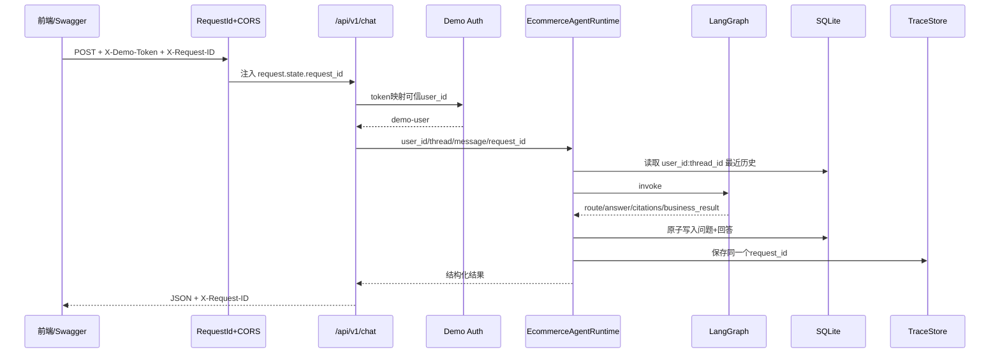

# 正式电商 Agent 后端：步骤1—2

> 本文描述 Python Agent 正式 API；跨语言的 Java 商品/订单/退款服务见
> [Python + Java 电商架构](python-java-ecommerce-architecture.md)。

## 本次完成内容

项目保留 `chapter01_*` 至 `chapter06_*` 作为学习过程，新建 `app/` 作为面试和后续前端真正依赖的正式后端入口。

```text
app/
├─ main.py                     应用工厂、中间件、路由装配
├─ api/
│  ├─ dependencies.py         运行时、配置和演示认证依赖
│  ├─ legacy.py               旧 /v1 隐藏兼容接口
│  └─ v1/
│     ├─ router.py            正式 /api/v1 路由聚合
│     └─ endpoints/           chat/catalog/orders/refunds/observability
├─ schemas/                   Pydantic请求与响应模型
├─ core/                      配置、请求ID、统一错误
├─ services/                  应用运行时门面
├─ agents/                    LangGraph稳定入口
├─ retrieval/                 混合检索稳定入口
└─ repositories/              SQLite聊天仓库稳定入口
```

这种结构让后续替换认证、数据库或Embedding时，前端API不必跟着学习章节路径变化。

## 修改前后

| 能力 | 修改前 | 修改后 |
|---|---|---|
| 项目入口 | `chapter06_ecommerce/api.py`单文件 | `app.main`正式应用工厂 |
| 路由 | `/v1`混在一个文件 | `/api/v1`按业务域拆分，旧路径隐藏兼容 |
| 错误 | 不同异常格式不同 | `error.code/message/details + request_id` |
| 请求关联 | Agent内部随机ID | `X-Request-ID`贯穿HTTP响应和Trace |
| 前端跨域 | 未配置 | 白名单CORS，默认允许Vite本地地址 |
| 回答传输 | 单次JSON | JSON与SSE两种接口 |
| 会话 | 只能聊天 | 会话列表与历史读取 |
| 商品 | 只能Agent推荐 | 商品列表、过滤和详情接口 |
| 订单 | 只能列出 | 列表与用户隔离的详情接口 |
| 退款 | 确认和状态 | 准备、确认、列表、状态和审计事件完整闭环 |
| OpenAPI | 缺少示例与错误模型 | 正式接口、请求示例、错误Schema |

## HTTP请求 Data Lineage



## SSE事件协议

`POST /api/v1/chat/stream` 返回：

```text
event: metadata  路由、意图、引用和request_id
event: delta     分块答案文本，可出现多次
event: done      耗时和结构化业务结果
```

当前实现是工作流完整执行后再进行SSE分块传输，目的是先稳定前后端事件协议。它不是DeepSeek逐Token流，简历和面试中不能描述成“LLM Token Streaming”。后续接入异步LangGraph/模型流时可以复用相同事件类型。

## 统一错误格式

```json
{
  "error": {
    "code": "validation_error",
    "message": "请求参数校验失败。",
    "details": []
  },
  "request_id": "req_xxx"
}
```

已覆盖认证失败、参数校验、资源不存在、业务冲突、限流和内部错误。内部异常不会向客户端暴露堆栈、数据库路径或外部服务细节。

## 配置

```text
ECOMMERCE_DATA_DIRECTORY   本地运行数据目录
ECOMMERCE_USE_LLM         是否允许调用DeepSeek，默认false
ECOMMERCE_RATE_LIMIT      单用户滑动窗口限额，默认30
ECOMMERCE_CORS_ORIGINS    逗号分隔的前端来源白名单
ECOMMERCE_JWT_SECRET      JWT签名密钥（生产环境必须外部注入）
ECOMMERCE_JWT_EXPIRE_MINUTES JWT有效期，默认120分钟
BUSINESS_SERVICE_URL      Java业务服务地址（启用REST工具时使用）
```

`.env`仍不进入Git、RAG、日志或API响应。

## 验证结果

```text
新增正式后端测试：12项通过
仓库全量测试：80项通过
```

新增测试覆盖版本化OpenAPI、请求ID关联、统一错误、CORS、SSE事件、会话隔离、商品和订单读取、退款完整闭环及审计事件。

## 下一步

步骤3会把 Python 的 Demo Token 和 Java 的 `X-User-Id` 替换为作品集级用户认证：用户表、密码哈希、JWT访问令牌、角色权限和服务端身份注入。步骤4再开发 React 前端，并直接消费本次稳定下来的 `/api/v1` 和 SSE 事件协议。Java 业务服务当前先用内存仓库跑通边界，之后将 Map 替换为 MyBatis-Plus Mapper，并让 Redis 承担分布式幂等与限流。
