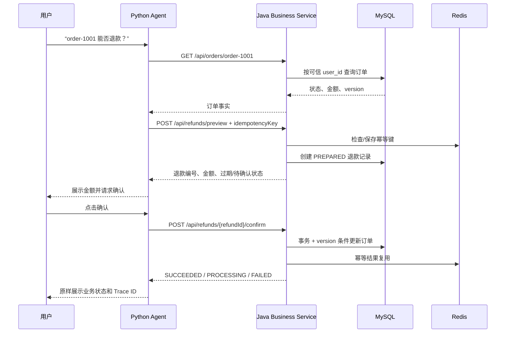

# Python Agent + Java 电商架构

## 项目定位

当前仓库的电商主线采用两个服务：

```text
前端/客户端
    ↓ HTTP + X-Request-ID
Python Agent（FastAPI + LangGraph + RAG）
    ↓ REST工具调用
Java Business Service（Spring Boot）
    ↓
MySQL（订单事实） + Redis（缓存/限流/幂等）
```

Python 负责不确定的语言任务：意图识别、证据检索、工具选择和回答组织。Java 负责确定性业务：权限、订单状态、退款金额、事务和并发控制。模型永远不能直接写 MySQL。

## 退款 Data Lineage



## Java 服务当前实现

`business-service/` 是第一阶段的可运行 Spring Boot 示例：

- `controller/`：REST 接口和请求头中的 `X-User-Id`、`X-Request-ID`；
- `service/CommerceService`：商品、订单、退款预览和确认；
- `dto/`：请求参数校验，避免模型传入任意字段；
- `exception/`：统一错误结构；
- `persistence/`：MyBatis-Plus Entity/Mapper 与 Redis 幂等存储适配器；
- `database/`：MySQL 表结构，退款使用 `(user_id, idempotency_key)` 唯一约束；
- `docker-compose.yml`：启动 MySQL、Redis 和 Java 容器的部署示例。

为了让没有 Java 环境的学习者也能读懂和启动，默认服务使用内存仓库；`persistence/` 中的 Mapper 和 Redis 组件在 `mysql` profile 下启用。代码中的 `@Transactional`、订单 `version`、唯一幂等键和 SQL 脚本展示了迁移到 MySQL/Redis 时的边界。当前不能把默认 demo 描述成已经完成生产级数据迁移。

## Python 工具映射

| Agent 工具 | Java 接口 | Java 的最终约束 |
|---|---|---|
| `query_product` | `GET /api/products/search`、`GET /api/products/{sku}` | 价格和库存只来自服务 |
| `query_order` | `GET /api/orders/{orderId}` | 只能读取当前用户订单 |
| `preview_refund` | `POST /api/refunds/preview` | 只创建待确认记录，不转账 |
| `confirm_refund` | `POST /api/refunds/{refundId}/confirm` | 事务、订单版本和幂等键共同保护 |

跨服务请求必须透传：

```text
X-User-Id       服务端认证后注入，不能信任模型生成
X-Request-ID    Python 与 Java 共用，串联日志和 Trace
Idempotency-Key 退款业务唯一键，不能只依赖自然语言
```

## JWT 认证

Python API 新增：

- `POST /api/v1/auth/login`：演示账号换取短期 JWT；
- `GET /api/v1/auth/me`：从 Bearer Token 解析当前用户；
- 业务接口优先使用 `Authorization: Bearer <token>`，旧 `X-Demo-Token` 仅保留给学习测试。

当前登录凭据仍是本地 demo 映射，密码没有进入 Git。生产环境应将用户表和密码哈希放在 Java/MySQL 或企业身份提供商中，Python 只验证签发的 JWT；`ECOMMERCE_JWT_SECRET` 必须通过密钥管理系统注入。

## 启动顺序

### 只学习 Java 业务层

```powershell
cd business-service
mvn spring-boot:run
```

### 启动 MySQL/Redis 基础设施

```powershell
docker compose up --build
```

首次启动前需要安装 Docker Desktop，并确认没有其他程序占用 `3306`、`6379` 和 `8081`。Python Agent 仍可按根目录 README 在 `8000` 端口启动。

## 面试表达

> 我把 Agent 和业务解耦：Python/LangGraph 负责意图路由、RAG 和工具编排，Java/Spring Boot 负责商品、订单和退款等确定性逻辑。退款采用 preview/confirm 两阶段流程，Java 侧用用户权限校验、订单状态机、幂等键、订单版本和事务避免模型幻觉或并发请求造成重复退款；跨服务通过 REST 和 Trace ID 关联调用。当前仓库提供内存 demo 和 MySQL/Redis 迁移脚本，生产环境会替换为真实 Repository、认证和分布式限流。
