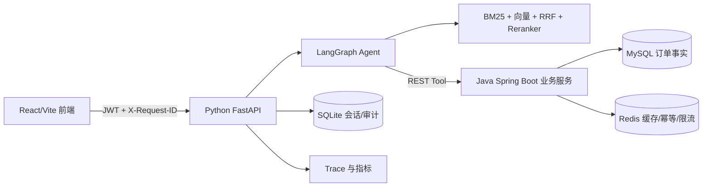
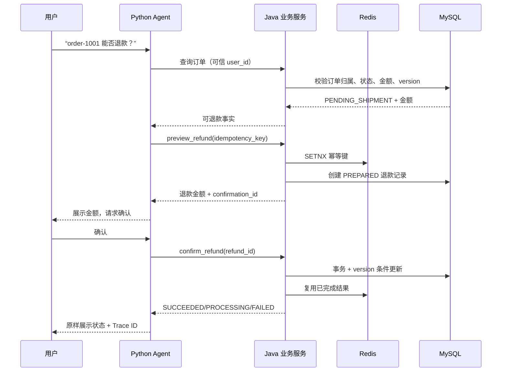

# 星河商城现场运行 Demo

## 运行

```powershell
& "C:\Users\19194\.conda\envs\langchain1.2\python.exe" scripts/xinghe_live_demo.py
```

这个 Demo 使用 FastAPI `TestClient` 在本地内存中运行，不调用 DeepSeek、不发送项目文件、不连接真实支付渠道。它依次展示 JWT 登录、Agent 政策问答、退款预览、用户确认和重复确认幂等。

## 架构图



## 退款时序图



## 现场讲解顺序

1. 先说明模型只负责理解语言和选择工具，价格、库存、订单状态来自业务服务。
2. 展示预览接口没有资金副作用，只有用户确认后才进入确认接口。
3. 连续执行两次确认，说明第二次返回第一次结果，证明幂等保护。
4. 打开 API 文档，展示 JWT、请求 ID、SSE、订单隔离和退款审计接口。
5. 强调当前 Java 默认内存仓库，MySQL/Redis 适配器和 Docker 配置用于后续生产迁移；不要把本地 Demo 描述成真实支付系统。
